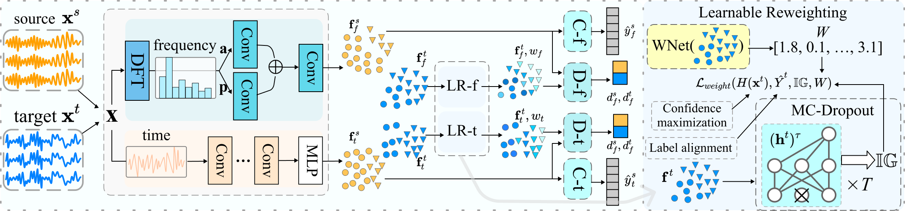

# DWLR: Domain Adaptation under Label Shift for Wearable Sensor

[Juren Li](jrlee@zju.edu.cn)$^1$, [Yang Yang](yangya@zju.edu.cn)$^{1*}$, [Youmin Chen](youminchen@zju.edu.cn)$^1$, [Jianfeng Zhang](zhangjianfeng3@huawei.com)$^2$, [Zeyu Lai](jerrylai@zju.edu.cn)$^1$, [Lujia Pan](panlujia@huawei.com)$^2$. ( $^*$ Correspondence )

$^1$ College of Computer Science and Technology, Zhejiang University

$^2$ Huawei Noah’s Ark Lab

---
[](https://yangy.org/works/domain/IJCAI24_DWLR.pdf)

This repo is the implementation of paper "DWLR: Domain Adaptation under Label Shift for Wearable Sensor" accepted by **IJCAI' 24**.

The [Appendix](https://github.com/JuRenGithub/DWLR/blob/main/Appendix.pdf) to the paper is available in this repository.


## DWLR


In this work, we propose <u>D</u>omain adaptation under label shift for <u>W</u>earable sensor with <u>L</u>earnable <u>R</u>eweighting (**DWLR**) to handle both feature and label shifts. 
Specifically, DWLR employs learnable reweighting to align label distributions between source and target domains. 
It incorporates elements of information gain during the reweighting process to counter potential distribution shift that could emerge from over-reliance on data with high-confidence pseudo labels. 
Additionally, DWLR performs reweighting and alignment in the time domain and frequency domain, respectively.

## Requirements
The recommended requirements for DWLR are specified as follow:
- Python 3.9
- torch==1.13.0
- numpy==1.21.5
- scikit-learn==1.0.2
- pandas==1.4.2

The dependencies can be installed by:

 ```bash
pip install -r requirements.txt
 ```

## Dataset

This repository provides the preprocessing code for [WISDM](https://www.cis.fordham.edu/wisdm/includes/files/sensorKDD-2010.pdf) dataset.

- [Download](https://www.cis.fordham.edu/wisdm/dataset.php) the WISDM dataset and unzip it to ``./data/wisdm``.
- run ``process_data.ipynb`` to preprocess the dataset.

You can also download and process other dataset: [UCIHAR](https://archive.ics.uci.edu/dataset/240/human+activity+recognition+using+smartphones), [HHAR](https://archive.ics.uci.edu/dataset/344/heterogeneity+activity+recognition) and [SleepEDF](https://physionet.org/content/sleep-edf/1.0.0/)

## Run
To run DWLR on the WISDM dataset, directly use the following script:
```bash
python main.py \
    --freq\
    --time\
    --adv_loss_weight 0.5\
    --batch_size 256\
    --class_num 6\
    --confidence 1.0\
    --cuda 0\
    --d_model 64\
    --emb_dim 64\
    --encoder cnn\
    --epochs 50\
    --IG 2\
    --in_dim 3\
    --label_regular 2.0\
    --lr 0.001\
    --l2 0.001\
    --n_freq 32\
    --n_head 2\
    --n_layer 4\
    --patch_len 8\
    --q_k_dim 32\
    --reweight_weight 2.\
    --seq_len 128\
    --source 20\
    --target 6\
    --T 100\
    --v_dim 32
```

## Contact
If you have any question about the code or the paper, feel free to contact me through [email](mailto:jrlee@zju.edu.cn).


## Citation

If you find DWLR useful in your research or applications, please kindly cite:

```
@inproceedings{li2024dwlr,
  title={DWLR: Domain Adaptation under Label Shift for Wearable Sensor},
  author={Juren Li and Yang Yang and Youmin Chen and Jianfeng Zhang and Zeyu Lai and Lujia Pan},
  booktitle={Proceedings of the International Joint Conference on Artificial Intelligence (IJCAI)},
  year={2024},
  note={Accepted}
}
```
